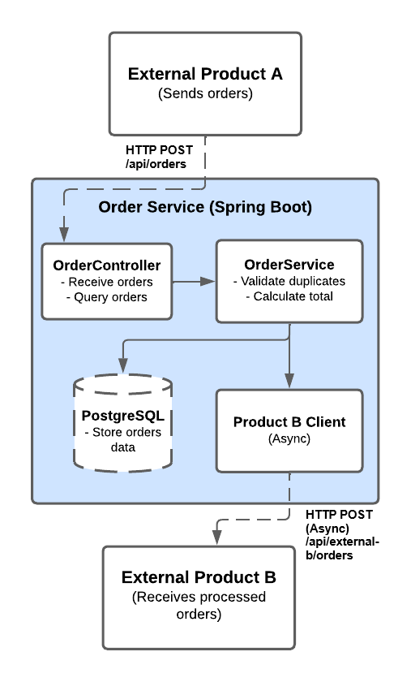

# Order Service

## Description
Order management service that receives orders from External Product A, calculates total values, and sends processed orders to External Product B.

## Technologies
- Java 21
- Spring Boot 4.0
- PostgreSQL 15
- Docker & Docker Compose
- Maven

## Architecture Overview


**Key Components:**
- **OrderController:** REST API endpoints
- **OrderService:** Business logic
- **OrderRepository:** Database access (JPA)
- **ExternalProductBClient:** Async integration
- **ThreadPool:** 10-20 threads for Product B
- **PostgreSQL:** Persistent storage

## How to Run

1. Start PostgreSQL:
```bash
docker-compose up -d
```

2. Run the application (Hibernate will create tables automatically):
```bash
./mvnw spring-boot:run
```

3. Create performance indexes:
```bash
docker exec -it order-service-db psql -U postgres -d order_db -c "CREATE INDEX idx_external_order_id ON orders(external_order_id);"
docker exec -it order-service-db psql -U postgres -d order_db -c "CREATE INDEX idx_status ON orders(status);"
```

Or connect to the database and run:
```sql
CREATE INDEX idx_external_order_id ON orders(external_order_id);
CREATE INDEX idx_status ON orders(status);
```


The application will be available on `http://localhost:8080`.

## API Endpoints

### Receive Order (from External Product A)
```http
POST /api/orders
Content-Type: application/json

{
  "orderId": "ORDER-001",
  "items": [
    {
      "productCode": "PROD-123",
      "productName": "Notebook",
      "unitPrice": 3000.00,
      "quantity": 2
    },
    {
      "productCode": "PROD-456",
      "productName": "Mouse",
      "unitPrice": 50.00,
      "quantity": 1
    }
  ]
}
```

### Get Order by External ID
```http
GET /api/orders/{externalOrderId}
```

### List Orders
```http
GET /api/orders

# Filter by status
GET /api/orders?status=PROCESSED
```

Available statuses: `RECEIVED`, `PROCESSED`, `SENT`, `ERROR`.

## Testing Guide

### Quick Test: Send an Order

**1. Send order to the service:**
```bash
curl -X POST http://localhost:8080/api/orders \
  -H "Content-Type: application/json" \
  -d '{
    "orderId": "TEST-001",
    "items": [
      {
        "productCode": "PROD-A",
        "productName": "Product A",
        "unitPrice": 100.00,
        "quantity": 2
      }
    ]
  }'
```

**Expected Response (HTTP 201):**
```json
{
  "id": 1,
  "externalOrderId": "TEST-001",
  "totalValue": 200.00,
  "status": "PROCESSED",
  "items": [
    {
      "productCode": "PROD-A",
      "productName": "Product A",
      "unitPrice": 100.00,
      "quantity": 2,
      "subtotal": 200.00
    }
  ],
  "createdAt": "2025-12-03T..."
}
```

**2. Check logs - Product B should have received:**
```
INFO - ========================================
INFO - PRODUCT B RECEIVED ORDER
INFO - Order ID: TEST-001
INFO - Total Value: 200.00
INFO - ========================================
```

**3. Verify order status changed to SENT:**
```bash
curl http://localhost:8080/api/orders/TEST-001
```

**Expected:** `"status": "SENT"`

**4. Test duplicate detection:**
```bash
# Send same order again
curl -X POST http://localhost:8080/api/orders \
  -H "Content-Type: application/json" \
  -d '{"orderId": "TEST-001", "items": [...]}'
```

**Expected Response (HTTP 409):**
```json
{
  "message": "Order already exists: TEST-001",
  "error": "Duplicate Order",
  "status": 409,
  "timestamp": "2025-12-03T..."
}
```

## Performance Tests

### Load Test Results
- **Tool:** Postman Runner


- **1000 concurrent requests** (70ms delay):
    - Success rate: >99%
    - Latency: 6-10ms
    - All orders received, processed and sent to Product B

- **500 concurrent requests** (0ms delay):
    - Success rate: 100%
    - Latency: 6-10ms
    - System remained stable under maximum load

### Capacity
- **Requirement:** 150-200k orders/day (~2 req/s average, with possible spikes)
- Considering the application processed bursts of 500-1000 requests with consistent 6-10ms latency,
the effective throughput is around **100+ req/s**, meaning the current design **comfortably exceeds**
the expected load, even during heavy bursts.
- If the product eventually requires heavier processing and/or significantly higher throughput,
then adopting message queues such as **RabbitMQ** or **Kafka** would be more suitable.

### Concurrency
- Duplicate detection working correctly (HTTP 409)
  - Tested with 0ms delay concurrent requests
- Async integration with Product B functioning properly
- All orders reached SENT status successfully

## Troubleshooting

### Database Connection Refused

1. Check PostgreSQL is running: `docker ps`
2. If not, start it: `docker-compose up -d`
3. Retry after initialization is complete

### Common Lombok Build Issues

#### "Cannot find symbol" build errors (IntelliJ)
Possible fixes:
- Install the Lombok Plugin
- Enable Annotation Processing
  - **Settings > Build, Execution, Deployment > Compiler > Annotation Processors**
  - Select **obtain processors from project classpath** in "Annotation profile for orders"
- Reload Maven Project
- Restart IDE (Invalidade Caches/Restart)
